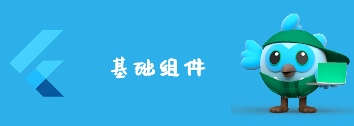

好了，学习完dart基础，我们就可以开始学习flutter了，我们还是先了解flutter的组件。
关于组件的学习，我打算按照分类来学习。
<!--truncate-->

## flutter基础组件

基础组件种类繁多，如果随意看的话会不成体系，我打算还是按照https://docs.flutter.dev/development/ui/widgets 上的分类来学习。

| 分类                                                         | 描述                 | 访问                                                         |
| ------------------------------------------------------------ | -------------------- | ------------------------------------------------------------ |
| [Accessibility](https://docs.flutter.dev/development/ui/widgets/accessibility) | accessible相关       | [Visit](https://docs.flutter.dev/development/ui/widgets/accessibility) |
| [Animation and Motion](https://docs.flutter.dev/development/ui/widgets/animation) | 动画相关             | [Visit](https://docs.flutter.dev/development/ui/widgets/animation) |
| [Assets, Images, and Icons](https://docs.flutter.dev/development/ui/widgets/assets) | 资源、图标相关       | [Visit](https://docs.flutter.dev/development/ui/widgets/assets) |
| [Async](https://docs.flutter.dev/development/ui/widgets/async) | 异步相关             | [Visit](https://docs.flutter.dev/development/ui/widgets/async) |
| [Basics](https://docs.flutter.dev/development/ui/widgets/basics) | 基础组件             | [Visit](https://docs.flutter.dev/development/ui/widgets/basics) |
| [Cupertino (iOS-style widgets)](https://docs.flutter.dev/development/ui/widgets/cupertino) | iOS样式相关组件      | [Visit](https://docs.flutter.dev/development/ui/widgets/cupertino) |
| [Input](https://docs.flutter.dev/development/ui/widgets/input) | 输入相关             | [Visit](https://docs.flutter.dev/development/ui/widgets/input) |
| [Interaction Models](https://docs.flutter.dev/development/ui/widgets/interaction) | 点击、路由等交互相关 | [Visit](https://docs.flutter.dev/development/ui/widgets/interaction) |
| [Layout](https://docs.flutter.dev/development/ui/widgets/layout) | 布局相关             | [Visit](https://docs.flutter.dev/development/ui/widgets/layout) |
| [Material Components](https://docs.flutter.dev/development/ui/widgets/material) | Material相关         | [Visit](https://docs.flutter.dev/development/ui/widgets/material) |
| [Painting and effects](https://docs.flutter.dev/development/ui/widgets/painting) | 绘制相关             | [Visit](https://docs.flutter.dev/development/ui/widgets/painting) |
| [Scrolling](https://docs.flutter.dev/development/ui/widgets/scrolling) | 滚动相关             | [Visit](https://docs.flutter.dev/development/ui/widgets/scrolling) |
| [Styling](https://docs.flutter.dev/development/ui/widgets/styling) | 主题等样式相关       | [Visit](https://docs.flutter.dev/development/ui/widgets/styling) |
| [Text](https://docs.flutter.dev/development/ui/widgets/text) | 文本显示相关         | [Visit](https://docs.flutter.dev/development/ui/widgets/text) |

