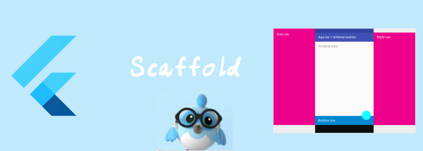

第一个基础组件Scaffold。

<!--truncate-->

## Scaffold

他实现了基本的material design layout。

layout它包含：

1. 一个导航栏AppBar
2. 一个body
3. 一个底部导航
4. 一个悬浮的按钮
5. 一个抽屉菜单

### 导航栏

```dart
//相关属性
PreferredSizeWidget? appBar,//导航栏
```

我们看到appBar需要一个`PreferredSizeWidget`, 而`PreferredSizeWidget`的实现类有以下几个

- [AppBar](https://api.flutter.dev/flutter/material/AppBar-class.html)
- [CupertinoTabBar](https://api.flutter.dev/flutter/cupertino/CupertinoTabBar-class.html)
- [ObstructingPreferredSizeWidget](https://api.flutter.dev/flutter/cupertino/ObstructingPreferredSizeWidget-class.html)
- [PreferredSize](https://api.flutter.dev/flutter/widgets/PreferredSize-class.html)
- [Tab](https://api.flutter.dev/flutter/material/Tab-class.html)
- [TabBar](https://api.flutter.dev/flutter/material/TabBar-class.html)

除掉Tab相关，我们能用在appBar处的只有`AppBar`,`ObstructingPreferredSizeWidget`和`PreferredSize`。

`AppBar`是material风格的appbar，有固定的模式，更简单。

`ObstructingPreferredSizeWidget`: 通常我们使用其实现类`CupertinoNavigationBar`,这是iOS风格导航栏

`PreferredSize` 需要你提供size和content，能够完全自定义。

#### AppBar

material风格的appbar，我们首先来看看AppBar的默认布局。


- Leading: 最左边的一个widget，如果为null，但是有Scaffold有Drawer，那么会自动在leading插入一个打开Drawer的按钮。如果最近的[Navigator](https://api.flutter.dev/flutter/widgets/Navigator-class.html) 有之前的页面，没有leading的话，会自动插入一个`BackButton`作为leading，不管你可以通过设置[automaticallyImplyLeading](https://api.flutter.dev/flutter/material/AppBar/automaticallyImplyLeading.html)为false来禁用这种行为。
- title: 显示title的widget，没啥特殊的，如果没有leading，那么title会向左补齐。
- Actions: 通常放置一些常用的按钮，如果是不常用的操作，建议通过[PopupMenuButton](https://api.flutter.dev/flutter/material/PopupMenuButton-class.html) 将他们隐藏起来。
- FlexibleSpace: 是包含toolbar和bottom的整个区域。FlexibleSpace一般不是flexible的, 除非AppBar的Container改变了AppBar的size。典型的情况是，滚动时，  [CustomScrollView](https://api.flutter.dev/flutter/widgets/CustomScrollView-class.html) 中的[SliverAppBar](https://api.flutter.dev/flutter/material/SliverAppBar-class.html) 会改变AppBar的高度。
- bottom：注意他的类型也是`PreferredSizeWidget`，通常都是个`TabBar`。

```dart

class BasicScreen extends StatelessWidget {
  const BasicScreen({Key? key}) : super(key: key);

  @override
  Widget build(BuildContext context) {
    return DefaultTabController(length: 3, child: Scaffold(
      appBar: AppBar(
        leading: Icon(Icons.delete), //leading
        title: Text("this is title"),// title
        actions: [// actions
        Icon(Icons.remove),
        Icon(Icons.abc)
      ],bottom: TabBar(tabs: [//bottom
        Tab(icon: Icon(Icons.yard),),
        Tab(icon: Icon(Icons.delete),),
        Tab(icon: Icon(Icons.face),)
      ],),),
      body: TabBarView(
        children: <Widget>[
          Center(
            child: Text("It's cloudy here"),
          ),
          Center(
            child: Text("It's rainy here"),
          ),
          Center(
            child: Text("It's sunny here"),
          ),
        ],
      ),
    ));
  }
}

```


#### CupertinoNavigationBar

ios风格的导航栏。

布局：只有leading, middle, trailing3个widget。

```dart
const CupertinoNavigationBar(
{Key? key,
Widget? leading,
bool automaticallyImplyLeading = true,
bool automaticallyImplyMiddle = true,
String? previousPageTitle,
Widget? middle, 
Widget? trailing,
Border? border = _kDefaultNavBarBorder,
Color? backgroundColor,
Brightness? brightness,
EdgeInsetsDirectional? padding,
bool transitionBetweenRoutes = true,
Object heroTag = _defaultHeroTag}
)
```

- `leading`: 设置leading widget ，如果leading为null，会根据automaticallyImplyLeading设置返回按钮
- `middle`:设置middle widget
- `trailing`: 设置trailing widget
- `automaticallyImplyLeading`: 为true且无leading时
  - 如果是全屏dialog，那么显示关闭按钮
  - 如果` previousPageTitle`不为空的话，显示关闭按钮+`previousPageTitle`
  - 如果当前和前一个都是[CupertinoPageRoute](https://api.flutter.dev/flutter/cupertino/CupertinoPageRoute-class.html) ，那么显示关闭按钮和前一个route的title
- `automaticallyImplyMiddle`:如果为true且middle为null时，默认用title创建个Text作为middle
- `border`:边框，默认是只有一个像素的下边框，为null不显示边框。
- `backgroundColor`:背景色，但如果是半透明的，那么会产生一个模糊效果显示底部区域。
- `padding`:  水平按ios规范是16px。如果leading是返回按钮的话，就是0。

```dart
class BasicScreen extends StatelessWidget {
  const BasicScreen({Key? key}) : super(key: key);

  @override
  Widget build(BuildContext context) {
    return Scaffold(
      appBar: CupertinoNavigationBar(
          middle: Text("title"),
          trailing: Icon(Icons.delete),
          leading: Icon(Icons.yard),
          backgroundColor: Colors.yellow,
          border: Border(bottom: BorderSide(color: Colors.purple, width: 3))),
      body: Center(
        child: Text("center"),
      ),
    );
  }
}
```


#### PreferredSize

能够完全自定义。

```dart
// 自定义PreferredSize的content
class AppBarContent extends StatelessWidget {
  const AppBarContent({Key? key}) : super(key: key);

  @override
  Widget build(BuildContext context) {
    return Column(
      mainAxisAlignment: MainAxisAlignment.end,
      children: <Widget>[
        Padding(
          padding: const EdgeInsets.symmetric(horizontal: 10),
          child: Row(
            children: <Widget>[
              const Text(
                'PreferredSize Sample',
                style: TextStyle(color: Colors.white),
              ),
              const Spacer(),
              IconButton(
                icon: const Icon(
                  Icons.search,
                  size: 20,
                ),
                color: Colors.white,
                onPressed: () {},
              ),
              IconButton(
                icon: const Icon(
                  Icons.more_vert,
                  size: 20,
                ),
                color: Colors.white,
                onPressed: () {},
              ),
            ],
          ),
        ),
      ],
    );
  }
}

class BasicScreen extends StatelessWidget {
  const BasicScreen({Key? key}) : super(key: key);

  @override
  Widget build(BuildContext context) {
    return Scaffold(
      appBar: PreferredSize(
        preferredSize: const Size.fromHeight(80.0),//设置size
        child: Container(//设置child
          decoration: const BoxDecoration(
            gradient: LinearGradient(
              colors: <Color>[Colors.blue, Colors.pink],
            ),
          ),
          child: const AppBarContent(),
        ),
      ),
      body: const Center(
        child: Text('Content'),
      ),
    );
  }
}
```


### 悬浮按钮

```dart
///相关属性
Widget? floatingActionButton,//悬浮的按钮
FloatingActionButtonLocation? floatingActionButtonLocation,//悬浮按钮的位置
FloatingActionButtonAnimator? floatingActionButtonAnimator,//微调悬浮按钮的位置
```

- floatingActionButtonLocation： 参考https://api.flutter.dev/flutter/material/FloatingActionButtonLocation-class.html
- floatingActionButton: 通常是FloatingActionButton
- floatingActionButtonAnimator: 用这个class来调整btutton的offset、scale、roate。使用方法是继承 `FloatingActionButtonAnimator`，然后重载方法。

下面是个例子

```dart
class FloatingOffsetActionButtonAnimator extends FloatingActionButtonAnimator {
  @override
  Offset getOffset({required Offset begin, required Offset end, required double progress}) {
    //progress是0是，默认位置是begin，progress为1时，默认位置为end
    return Offset(end.dx + 100, end.dy);//向右偏移100
  }

  @override
  Animation<double> getRotationAnimation({required Animation<double> parent}) {
    return parent;
  }

  @override
  Animation<double> getScaleAnimation({required Animation<double> parent}) {
    return parent;
  }

}

class BasicScreen extends StatelessWidget {
  const BasicScreen({Key? key}) : super(key: key);
  @override
  Widget build(BuildContext context) {
    return Scaffold(
      appBar: AppBar(
        title: const Text('Sample Code'),
      ),
      body: Center(child: Text('This is Body')),
      floatingActionButton: FloatingActionButton(onPressed: () => print("clicked"), child: Icon(Icons.add),),
      floatingActionButtonLocation: FloatingActionButtonLocation.miniStartTop,
      floatingActionButtonAnimator: FloatingOffsetActionButtonAnimator(),
    );
  }
}
```


### 抽屉

```dart
//相关属性
Widget? drawer,//左抽屉
Widget? endDrawer,//右抽屉
DrawerCallback? onDrawerChanged,//左抽屉打开/关闭的回调
DrawerCallback? onEndDrawerChanged,//右抽屉打开/关闭的回调
//分为start和down，start更顺滑，down响应更快
DragStartBehavior drawerDragStartBehavior = DragStartBehavior.start,
Color? drawerScrimColor,//抽屉旁边空白的颜色
double? drawerEdgeDragWidth,//设置响应drag的宽度，默认是20 + MediaQuery.of(context).padding
bool drawerEnableOpenDragGesture = true,//能否通过手势打开左抽屉
bool endDrawerEnableOpenDragGesture = true,//能否通过手势打开右抽屉
```

```dart
class BasicScreen extends StatelessWidget {
  const BasicScreen({Key? key}) : super(key: key);

  @override
  Widget build(BuildContext context) {
    return Scaffold(
      appBar: AppBar(
        title: Text("drawer demo"),
      ),
      drawer: Drawer(
        child: Center(
          child: Column(
            mainAxisAlignment: MainAxisAlignment.center,
            children: <Widget>[
              const Text('This is the left Drawer'),
              Builder(builder: (context) {
                return IconButton(
                    onPressed: () {
                      Scaffold.of(context).closeDrawer();
                    },
                    icon: Icon(Icons.delete));
              }),
            ],
          ),
        ),
      ),
      endDrawer: Drawer(
        child: Center(
          child: Column(
            mainAxisAlignment: MainAxisAlignment.center,
            children: <Widget>[
              const Text('This is the right Drawer'),
              Builder(builder: (context) {
                return IconButton(
                    onPressed: () {
                      Scaffold.of(context).closeDrawer();
                    },
                    icon: Icon(Icons.delete));
              }),
            ],
          ),
        ),
      ),
      body: Center(
        child: Builder(
          builder: (context) {
            return IconButton(
                onPressed: () {
                  Scaffold.of(context).openDrawer();
                },
                icon: Icon(Icons.yard));
          },
        ),
      ),
    );
  }
}
```

### 底部导航

```dart
//相关属性
Widget? bottomNavigationBar,//底部导航
//也是固定在底部的，出现在body之下，bottomNavigationBar之上
List<Widget>? persistentFooterButtons,
//也是固定在底部的,persistentFooterButtons之上,盖在body上的
Widget? bottomSheet,
```

```dart

class BasicScreen extends StatefulWidget {
  const BasicScreen({Key? key}) : super(key: key);

  @override
  State<BasicScreen> createState() => _BasicScreenState();
}

class _BasicScreenState extends State<BasicScreen> {
  var currentIndex = 0;
  void handleSelectIndexChanged(int index) {
    setState(() {
      currentIndex = index;
    });
  }

  @override
  Widget build(BuildContext context) {
    return Scaffold(
      appBar: AppBar(
        title: Text("bottom bar demo"),
      ),
      body: ListView(
        children: [
          Container(
            color: Colors.orange,
            child: Text("aaa"),
            height: 300,
          ),
          Container(
            color: Colors.red,
            child: Text("bbb"),
            height: 300,
          ),
          Container(
            color: Colors.blue,
            child: Text("ccc"),
            height: 300,
          ),
        ],
      ),
      persistentFooterButtons: [
        Icon(Icons.yard),
        TextButton(onPressed: () {}, child: Text("helloworld"))
      ],
      bottomNavigationBar: BottomNavigationBar(
        items: [
          BottomNavigationBarItem(icon: Icon(Icons.delete), label: "删除"),
          BottomNavigationBarItem(icon: Icon(Icons.yard), label: "花园")
        ],
        onTap: handleSelectIndexChanged,
        currentIndex: currentIndex,
      ),
      bottomSheet: Container(
        color: Colors.red,
        child: Text("hell world"),
      ),
    );
  }
}
```


### 其他

```dart
//body
Widget? body,
//整个Scaffold的背景色，不只是body的
Color? backgroundColor,
//键盘弹出相关
bool? resizeToAvoidBottomInset,
//如果为true，那么extend body到Scaffold的底部，而不是在bottomNavigationBar或者persistentFooterButtons的顶部
bool extendBody = false,
// body是否extend到appbar的顶部，比如在appbar是半透明时使用
bool extendBodyBehindAppBar = false,
```