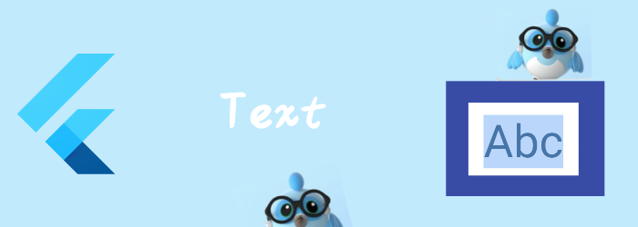

我们来看看如何显示文本Text。

<!--truncate-->

### Text

[Text](https://api.flutter.dev/flutter/widgets/Text-class.html) widget 显示的是某个style下的字符串。字符串根据布局约束，可能显示一行或者多行。

```dart
const Text(
String data,
{Key? key,
TextStyle? style,
StrutStyle? strutStyle,
TextAlign? textAlign,
TextDirection? textDirection,
Locale? locale,
bool? softWrap,
TextOverflow? overflow,
double? textScaleFactor,
int? maxLines,
String? semanticsLabel,
TextWidthBasis? textWidthBasis,
TextHeightBehavior? textHeightBehavior}
)
```

- data: 要显示的字符串

- style: `style`参数是可选的，如果你没有设置`style`，那么Text会使用最近的[DefaultTextStyle](https://api.flutter.dev/flutter/widgets/DefaultTextStyle-class.html)。

  如果你设置了`style`，且设置了`style`的inherit为true，那么最终的style会是你设置的style+最近的DefaultTextStyle。

- strutStyle: 定义了这个段落的每一行的最小行高，包括他的child TextSpan。如果设置了[forceStrutHeight](https://api.flutter.dev/flutter/painting/StrutStyle/forceStrutHeight.html) 那么每一行都强制为strut的高度。strut的高度为以下之和

  - `0.5 * leading`
  - `ascent * height`
  - `descent * height`
  - `0.5 * leading`

  从上我们看出我们设置leading , leading * fontSize拿到 leading的大小，这个大小分成2半，分别添加到height的上下。如果没有指定height，那么ascent和descent由字体决定，如果指定了height，那么会他调整ascent和descent，以满足ascent * height + descent * height = fontSize。

  ascent代表的是baseline上面的那部分。

  descent代表baseline下面的那部分。

- textAlign: 文字在水平方向上的对其方式

  - Left : 左对齐
  - Right: 右对齐
  - Start: 和leading对其，leading取决于是从左到右的语言还是从右到左的语言。
  - end：和trailing对其，同上
  - Center: 居中
  - Justify: 对于soft line break的情况(即自动换行)，那么会拉伸这一行，对hard line break的情况(即有换行符的换行)，那么这一行对其规则同start。

- textDirection： 文字方向，我们的通常都从左到右，阿拉伯的是从右到左。

- softWrap:  为true，代表正常排不下了就wrap换行，如果为false，那么只有在遇到换行符才会换行，没有遇到换行符之前会认为水平方向是无限宽的，会一直往水平方向排版。

- overflow： 溢出时的行为

  - clip: 裁剪掉，如果softWarp为true，裁剪的位置是最后一个单词，如果为false，那么裁剪的位置是边缘。
  - Fade: 末尾渐变到透明，需要设置softWarp为true才能看到效果。
  - ellipsis： 末尾打省略号
  - visible: 超出了也可见，需要设置softWarp为true才能看到效果。

- textScaleFactor: 文字缩放比例, 比如1.5，那么文字会增大50%

- maxLines:  最大行数，达到最大行数会根据overflow进行截断

- textWidthBasis： 

- textHeightBehavior:


### TextStyle

```dart
//颜色相关
// 同时只能设置一个，color是foreground = Paint()..color的缩写
Color? color, 
Paint? foreground,
// 同时只能设置一个，backgroundColor是background = Paint()..color的缩写
Color? backgroundColor,
Paint? background,
```

```dart
//字体相关
double? fontSize,//字体大小
FontWeight? fontWeight,//字重，比如bold
String? fontFamily,//字体
List<String>? fontFamilyFallback,
FontStyle? fontStyle,//比如斜体
```

```dart
//装饰相关
TextDecoration? decoration,// 是下划线、中划线、还是上划线
Color? decorationColor,//线的颜色
TextDecorationStyle? decorationStyle,//是实线、虚线、波浪线等等
double? decorationThickness,//可以调整线的粗细，默认1.0
```

```dart
//其他
//影响fontFamily,fontFamily = package == null ? fontFamily : 'packages/$package/$fontFamily',
String? package,
double? letterSpacing,//字符间间距
double? wordSpacing,//单词间间距
TextOverflow? overflow//和在Text上设置overflow一样的
TextBaseline? textBaseline,// 
TextLeadingDistribution? leadingDistribution,//如下图，虽然文档是这么说的，但是实际按照这么设置leadingDistribution并没有出现期望的结果- -!。
double? height,//排除strut的影响，行高为height * fontSize
List<Shadow>? shadows,//设置文字阴影
List<FontFeature>? fontFeatures,//有些字体会提供字体特性，暂不关注
```


- Configuration 1: 默认的. [leadingDistribution](https://api.flutter.dev/flutter/painting/TextStyle/leadingDistribution.html) 是 [TextLeadingDistribution.proportional](https://api.flutter.dev/flutter/dart-ui/TextLeadingDistribution.html).
- Configuration 2: 同1, 但是 [TextHeightBehavior.applyHeightToFirstAscent](https://api.flutter.dev/flutter/dart-ui/TextHeightBehavior/applyHeightToFirstAscent.html)是false
- Configuration 3: [leadingDistribution](https://api.flutter.dev/flutter/painting/TextStyle/leadingDistribution.html) 设为 [TextLeadingDistribution.even](https://api.flutter.dev/flutter/dart-ui/TextLeadingDistribution.html)(实际并没有居中)
- Configuration 4: 同3, 但 [TextHeightBehavior.applyHeightToLastDescent](https://api.flutter.dev/flutter/dart-ui/TextHeightBehavior/applyHeightToLastDescent.html) 是false。

### DefaultTextStyle

我们在前面说过没有style或者设置了继承，那么style会和最近的DefaultTextStyle合并。

我们可以用一个DefaultTextStyle来定义多个Text的通用style。

```dart
Container(
width: 300,
height: 400,
color: Colors.red,
child: DefaultTextStyle(
  style: TextStyle(color: Colors.green),
  child: Row(
    children: [
      Text("hello"),
      Text("world"),
    ],
    crossAxisAlignment: CrossAxisAlignment.start,
  ),
))
```

### RichText

组合多个TextSpan提供不同文字的不同style。

```dart
RichText(
text: TextSpan(
  text: 'Hello ',
  children: <TextSpan>[
    TextSpan(text: 'bold', style: TextStyle(fontWeight: FontWeight.bold)),
    TextSpan(text: ' world!',style: TextStyle(fontSize: 30),recognizer: TapGestureRecognizer()..onTap=() {//TextSpan还可以设置点击事件
        print("clicked world");
    }),
  ],
),
)
```

### WidgetSpan

富文本怎么少得了嵌入自定义Widget呢？WidgetSpan就是这个功能。

```dart
Text.rich(
  TextSpan(
    children: <InlineSpan>[
      TextSpan(text: 'Flutter is'),
      WidgetSpan(//文字中嵌入一个Widget。
        child: SizedBox(
          width: 120,
          height: 50,
          child: Card(
            child: Center(
              child: Text('Hello World!')
            )
          ),
        )
      ),
      TextSpan(text: 'the best!'),
    ],
  )
)
```

### TextPainter

可以将TextSpan绘制到Canvas中。


