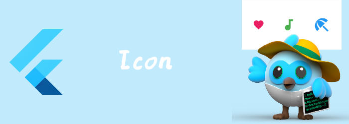

我们来看看Icon。

<!--truncate-->

### Icon

图标， 只是显示，不可交互的。图标是正方形的。

```dart
const Icon(
IconData? icon,
{Key? key,
double? size,
Color? color,
String? semanticLabel,
TextDirection? textDirection,
List<Shadow>? shadows}
)
```

- icon:  图标，Icons里提供了很多的默认图标，这个可以为null，为null时，绘制的是空的Size那么大的区域。
- size ：图标的大小，默认是IconTheme的size。如果没有IconTheme，那么默认是24。如果你使用的是IconButton，那么请设置[IconButton.iconSize](https://api.flutter.dev/flutter/material/IconButton/iconSize.html)，IconButton会通过IconTheme将size传递给Icon。
- color： 图标颜色, 同样没有的话，受IconTheme影响，如果没有IconTheme，那么会受Theme影响，如果也没有Theme，那么默认是黑色。
- semanticLabel： 语意label
- textDirection：和Text的一样，对某些图标，比如返回“🔙”，那么ltf和rtl显示的方向是反的。

```dart
Icon(
  Icons.beach_access,
  color: Colors.blue,
  size: 36.0,
)
```

### Icons

material图标，需要在项目的 `pubspe`设置`uses-material-design: true` ，才会把`MaterialIcons font `包含到app中。

```dart
Icons.audiotrack
```

### IconTheme

控制[Icon](https://api.flutter.dev/flutter/widgets/Icon-class.html) 和 [ImageIcon](https://api.flutter.dev/flutter/widgets/ImageIcon-class.html) widget的默认color, opacity,  size和shadow。

```dart
const IconThemeData(
{Color? color,
double? opacity,
double? size,
List<Shadow>? shadows}
)
```

```dart
IconTheme(
  data: IconThemeData(color: Colors.yellow, size: 30, opacity: 0.5),
  child: Row(
    children: [
      Icon(
        Icons.arrow_back,
        textDirection: TextDirection.rtl,
      ),
      Icon(Icons.yard),
    ],
  ),
)
```

### ImageIcon

显示的icon由[ImageProvider](https://api.flutter.dev/flutter/painting/ImageProvider-class.html)提供。其实现类有

- [AssetBundleImageProvider](https://api.flutter.dev/flutter/painting/AssetBundleImageProvider-class.html)
- [FileImage](https://api.flutter.dev/flutter/painting/FileImage-class.html)
- [MemoryImage](https://api.flutter.dev/flutter/painting/MemoryImage-class.html)
- [NetworkImage](https://api.flutter.dev/flutter/painting/NetworkImage-class.html)
- [ResizeImage](https://api.flutter.dev/flutter/painting/ResizeImage-class.html)
- [ScrollAwareImageProvider](https://api.flutter.dev/flutter/widgets/ScrollAwareImageProvider-class.html)

```dart
ImageIcon(NetworkImage(
"https://gimg2.baidu.com/image_search/src=http%3A%2F%2Fimg.zcool.cn%2Fcommunity%2F01fc6959b1fbeba801211d253c5180.png%401280w_1l_2o_100sh.png&refer=http%3A%2F%2Fimg.zcool.cn&app=2002&size=f9999,10000&q=a80&n=0&g=0n&fmt=auto?sec=1655607620&t=dbef4e1014d9fe951c7125bda26d0109"),size: 88,)
```

### IconButton

 material design 风格的图标按钮。

```dart
//常用属性
required Widget icon
required VoidCallback? onPressed,
double? iconSize,
Color? color,
EdgeInsetsGeometry padding = const EdgeInsets.all(8.0),
//对其方式，但我们更改了constraints，让Box变大了，那么对其方式就能影响Icon位置
AlignmentGeometry alignment = Alignment.center,
//控制BoxConstraints
BoxConstraints? constraints,
```

```dart
//其他
VisualDensity? visualDensity,
double? splashRadius,//material design的声波半径
Color? splashColor,//声波颜色
 Color? focusColor,
 Color? disabledColor,
 MouseCursor? mouseCursor,
 FocusNode? focusNode,
 bool autofocus = false,
Color? hoverColor,
Color? highlightColor,
String? tooltip,//长按时显示的提示文字
bool enableFeedback = true,//是否开启反馈，比如在android上，点击会有声音，长按会震动
```

```dart
 IconButton(onPressed: (){
	print("clicked");
}, icon: Icon(Icons.volume_up),
iconSize: 88,
color: Colors.yellow,)
```

IconButton并不支持设置background color 或者其他 background decoration。因为IconButton本质上就是将Icon添加的Widget的background上。不过我们可以通过 [Ink](https://api.flutter.dev/flutter/material/Ink-class.html) widget来给IconButton添加个filled background。 因为 [Ink](https://api.flutter.dev/flutter/material/Ink-class.html) widget 可以在底层的[Material](https://api.flutter.dev/flutter/material/Material-class.html) 上渲染一个decoration 。

```dart
Ink(
  decoration: const ShapeDecoration(
    color: Colors.lightBlue,
    shape: CircleBorder(),
  ),
  child: IconButton(
    icon: const Icon(Icons.android),
    color: Colors.white,
    onPressed: () {},
  ),
)
```


