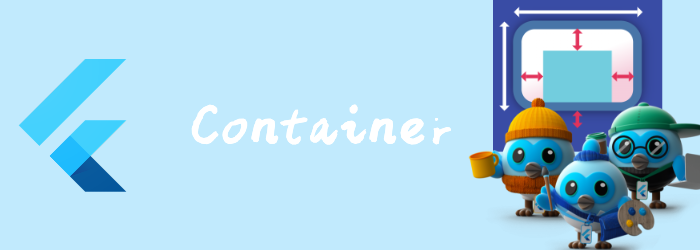

我们来看看Container。一个常用的容器widget。

<!--truncate-->

## BoxConstraints

在开始了解Container是如何layout前，我们还需要知道一些BoxConstraints相关的术语。

BoxConstraints是 [RenderBox](https://api.flutter.dev/flutter/rendering/RenderBox-class.html) layout的布局约束。他由四个值组成：`minWidth`、`maxWidth`、`minHeight`、`maxHeight`。

最终计算出widget的size需要满足以下约束条件：

- [minWidth](https://api.flutter.dev/flutter/rendering/BoxConstraints/minWidth.html) <= [Size.width](https://api.flutter.dev/flutter/dart-ui/Size/width.html) <= [maxWidth](https://api.flutter.dev/flutter/rendering/BoxConstraints/maxWidth.html)
- [minHeight](https://api.flutter.dev/flutter/rendering/BoxConstraints/minHeight.html) <= [Size.height](https://api.flutter.dev/flutter/dart-ui/Size/height.html) <= [maxHeight](https://api.flutter.dev/flutter/rendering/BoxConstraints/maxHeight.html)

而BoxConstraints自身也应该满足以下条件:

- 0.0 <= [minWidth](https://api.flutter.dev/flutter/rendering/BoxConstraints/minWidth.html) <= [maxWidth](https://api.flutter.dev/flutter/rendering/BoxConstraints/maxWidth.html) <= [double.infinity](https://api.flutter.dev/flutter/dart-core/double/infinity-constant.html)
- 0.0 <= [minHeight](https://api.flutter.dev/flutter/rendering/BoxConstraints/minHeight.html) <= [maxHeight](https://api.flutter.dev/flutter/rendering/BoxConstraints/maxHeight.html) <= [double.infinity](https://api.flutter.dev/flutter/dart-core/double/infinity-constant.html)

### box layout model

我们来看看flutter的Box布局模型：

flutter从渲染树的根节点向下传递Constraints，每个[RenderBox](https://api.flutter.dev/flutter/rendering/RenderBox-class.html)从其父级接收[BoxConstraints](https://api.flutter.dev/flutter/rendering/BoxConstraints-class.html)，然后子级根据自身的大小和Constraints选择满足[BoxConstraints](https://api.flutter.dev/flutter/rendering/BoxConstraints-class.html)的[Size](https://api.flutter.dev/flutter/dart-ui/Size-class.html)，然后沿着渲染树向上传递具体的Size。父级根据Size知道如何在自身中layout子级widget。这样一次从上到下，再从下到上，就能确定所有widget的位置。

### 一些术语

- `tightly`： 当`minimum constraints`和`maximum constraint `是一样的时，我们称这个约束为`tightly constrained`。相关的方法有：[BoxConstraints.tightFor](https://api.flutter.dev/flutter/rendering/BoxConstraints/BoxConstraints.tightFor.html), [BoxConstraints.tightForFinite](https://api.flutter.dev/flutter/rendering/BoxConstraints/BoxConstraints.tightForFinite.html), [tighten](https://api.flutter.dev/flutter/rendering/BoxConstraints/tighten.html), [hasTightWidth](https://api.flutter.dev/flutter/rendering/BoxConstraints/hasTightWidth.html), [hasTightHeight](https://api.flutter.dev/flutter/rendering/BoxConstraints/hasTightHeight.html), [isTight](https://api.flutter.dev/flutter/rendering/BoxConstraints/isTight.html).
- `loose`: 当`minimum constraint`是0.0时，我们称其为`loose constrained ` 。如果同时`maximum constraint`也是0.0，那么这个约束既是`tight`也是`loose`。相关方法有：[BoxConstraints.loose](https://api.flutter.dev/flutter/rendering/BoxConstraints/BoxConstraints.loose.html), [loosen](https://api.flutter.dev/flutter/rendering/BoxConstraints/loosen.html)。
- `bounded`: 当`maximum constraint`不是`infinite`时，我们称其为`bounded`。相关方法有：[hasBoundedWidth](https://api.flutter.dev/flutter/rendering/BoxConstraints/hasBoundedWidth.html), [hasBoundedHeight](https://api.flutter.dev/flutter/rendering/BoxConstraints/hasBoundedHeight.html).
- `unbounded`: 当`maximum constraint`是`infinite`时，我们称其为`unbounded`。
- `infinite`: 当`minimum constraint`是`infinite`，此时的`maximum constraint`也只能是`infinite`，我们称其为`infinite`，相关方法：[hasInfiniteWidth](https://api.flutter.dev/flutter/rendering/BoxConstraints/hasInfiniteWidth.html), [hasInfiniteHeight](https://api.flutter.dev/flutter/rendering/BoxConstraints/hasInfiniteHeight.html) 。
- `constrained`: 当`size`满足BoxConstraints时，我们称其为`constrained`。相关方法有[constrain](https://api.flutter.dev/flutter/rendering/BoxConstraints/constrain.html), [constrainWidth](https://api.flutter.dev/flutter/rendering/BoxConstraints/constrainWidth.html), [constrainHeight](https://api.flutter.dev/flutter/rendering/BoxConstraints/constrainHeight.html), [constrainDimensions](https://api.flutter.dev/flutter/rendering/BoxConstraints/constrainDimensions.html), [constrainSizeAndAttemptToPreserveAspectRatio](https://api.flutter.dev/flutter/rendering/BoxConstraints/constrainSizeAndAttemptToPreserveAspectRatio.html), [isSatisfiedBy](https://api.flutter.dev/flutter/rendering/BoxConstraints/isSatisfiedBy.html)。

## Container

contaienr的布局行为，我们可以参考官方文档https://api.flutter.dev/flutter/widgets/Container-class.html

中的Layout behavior。其描述有点复杂。因为Container实际上是有Padding、Align、ColorBox、DecorationBox、ConstraintBox等一系列的Widget组合而成，如果你需要用到多个组合那么用Container比较合适，但如果就只用1个，那么还是推荐就用单一的widget。

```dart
Container(
{Key? key,
AlignmentGeometry? alignment,
EdgeInsetsGeometry? padding,
Color? color,
Decoration? decoration,
Decoration? foregroundDecoration,
double? width,
double? height,
BoxConstraints? constraints,
EdgeInsetsGeometry? margin,
Matrix4? transform,
AlignmentGeometry? transformAlignment,
Widget? child,
Clip clipBehavior = Clip.none}
)
```

- alignment: child在Container中的对其方式，如果child为null，则忽略这个属性。实际上是创建一个Align包裹child。

- padding：设置padding。实际上是创建一个Padding包裹child。

- color：背景颜色，实际上是创建一个ColoredBox包裹child。

- decoration：实际上是创建一个DecoratedBox包裹child。

- foregroundDecoration： 实际上是创建一个DecoratedBox包裹child。

- width和height: 被转换成constraints,  实际上是创建一个ConstrainedBox包裹child。

- constraints: 应用到child上的额外约束，实际上是创建一个ConstrainedBox包裹child。

- margin： 实际上是创建一个Padding包裹child。

- transform和transformAlignment: 实际上是创建一个Transform包裹child。

- clipBehavior： 当decoration不为null时的裁剪行为。实际上是创建一个ClipPath包裹child。

我们具体学到每个Widget时，再来看这些widget的属性和demo。
