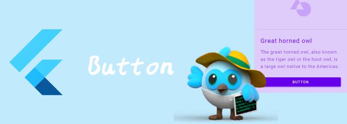

我们来看看基础布局Widget：Button。

<!--truncate-->

# ElevatedButton

一个Material Design 风格的Elevated按钮，通常用在一些扁平布局中，突出显示。

ElevatedButton本身没有太多属性，全靠style设置。

```dart
///没什么特别的，重点看看ButtonStyle
const ElevatedButton(
{Key? key,
required VoidCallback? onPressed,
VoidCallback? onLongPress,
ValueChanged<bool>? onHover,
ValueChanged<bool>? onFocusChange,
ButtonStyle? style,
FocusNode? focusNode,
bool autofocus = false,
Clip clipBehavior = Clip.none,
required Widget? child}
)
```

### ButtonStyle

ButtonStyle的大部分属性都是[MaterialStateProperty](https://api.flutter.dev/flutter/material/MaterialStateProperty-class.html) 。MaterialStateProperty\<T\>是对某个MaterialState下，应该显示的T。举个例子：

```dart
 ElevatedButton(child: Text("hello world"), onPressed: (){
  print("clickd");
},style: ButtonStyle(textStyle: MaterialStateProperty.resolveWith<TextStyle>((state){
  if(state.contains(MaterialState.pressed)) {//按下的状态
    return TextStyle(fontSize: 18, foreground: Paint()..color = Colors.red);
  } else {//非按下状态
    return TextStyle(fontSize: 48, foreground: Paint()..color = Colors.green);
  }
})),)
```

我们来看看ButtonStyle都能控制写什么：

```dart
const ButtonStyle(
{MaterialStateProperty<TextStyle?>? textStyle,
MaterialStateProperty<Color?>? backgroundColor,
MaterialStateProperty<Color?>? foregroundColor,
MaterialStateProperty<Color?>? overlayColor,
MaterialStateProperty<Color?>? shadowColor,
MaterialStateProperty<Color?>? surfaceTintColor,
MaterialStateProperty<double?>? elevation,
MaterialStateProperty<EdgeInsetsGeometry?>? padding,
MaterialStateProperty<Size?>? minimumSize,
MaterialStateProperty<Size?>? fixedSize,
MaterialStateProperty<Size?>? maximumSize,
MaterialStateProperty<BorderSide?>? side,
MaterialStateProperty<OutlinedBorder?>? shape,
MaterialStateProperty<MouseCursor?>? mouseCursor,
VisualDensity? visualDensity,
MaterialTapTargetSize? tapTargetSize,
Duration? animationDuration,
bool? enableFeedback,
AlignmentGeometry? alignment,
InteractiveInkFeatureFactory? splashFactory}
)
```

- `textStyle` : 作用于button的所有`Text` 子widget。但是要注意color没效果，用TextStyle的foreground代替，或者使用ButtonStyle的`foregroundColor`。
- `backgroundColor`: button的背景色
- `foregroundColor`: 作用于button的所有`Text` 、`Icon`子widget。设置他们的`color`。
- `overlayColor`:  button focused, hovered,  pressed的高亮颜色。
- `shadowColor`: 阴影颜色
- `surfaceTintColor`:  button的[Material.surfaceTintColor](https://api.flutter.dev/flutter/material/Material/surfaceTintColor.html) 。
- `elevation`: 高度，视觉上是阴影位置的变化
- `padding`: child和button之间的padding
- `minimumSize`: 最小size
- `maximumSize`: 最大size
- `fixedSize`: 固定size·
- `side`: border信息
- `shape`:border形状
- `tapTargetSize`:点击区域大小
- `animationDuration`: shape和elevation的动画时间
- `alignment`:child的对其方式
- `splashFactory`: InkWell的splashFactory，指定InkWell的外观，可以用NoSplash.splashFactory不显示InkWell。

### 通过styleFrom创建ButtonStyle

也可以通过ElevatedButton.styleFrom静态方法创建。就不用写很多的MaterialStateProperty。

TextButton和OutlineButton也有对应的方法。

```dart
ButtonStyle styleFrom(
{Color? primary,
Color? onPrimary,
Color? onSurface,
Color? shadowColor,
Color? surfaceTintColor,
double? elevation,
TextStyle? textStyle,
EdgeInsetsGeometry? padding,
Size? minimumSize,
Size? fixedSize,
Size? maximumSize,
BorderSide? side,
OutlinedBorder? shape,
MouseCursor? enabledMouseCursor,
MouseCursor? disabledMouseCursor,
VisualDensity? visualDensity,
MaterialTapTargetSize? tapTargetSize,
Duration? animationDuration,
bool? enableFeedback,
AlignmentGeometry? alignment,
InteractiveInkFeatureFactory? splashFactory}
)
```

# TextButton

一个扁平的文字按钮。基本和ElevatedButton是一样的，不详细了解了。

```dart
const TextButton(
{Key? key,
required VoidCallback? onPressed,
VoidCallback? onLongPress,
ValueChanged<bool>? onHover,
ValueChanged<bool>? onFocusChange,
ButtonStyle? style,
FocusNode? focusNode,
bool autofocus = false,
Clip clipBehavior = Clip.none,
required Widget child}
)
```

# OutlinedButton

本质上就是带边框的TextButton, 初始化方法基本一致，只是他的style默认值不一样而已。

```dart
const OutlinedButton(
{Key? key,
required VoidCallback? onPressed,
VoidCallback? onLongPress,
ValueChanged<bool>? onHover,
ValueChanged<bool>? onFocusChange,
ButtonStyle? style,
FocusNode? focusNode,
bool autofocus = false,
Clip clipBehavior = Clip.none,
required Widget child}
)
```

