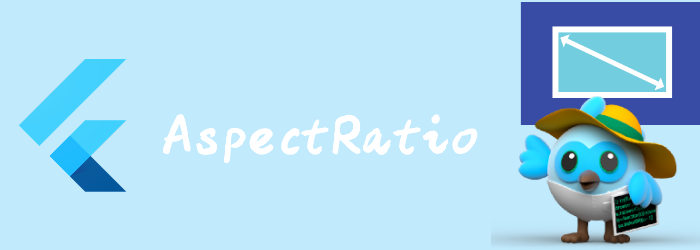

我们来看看布局相关widget: AspectRatio。

<!--truncate-->

## AspectRatio

尝试调整child的大小为指定的宽高比。

widget首先会尝试用约束的maximum width，然后根据宽高比计算出height。

如果height满足约束，那么height就是这么多。

```dart
Container(
    color: Colors.green,
    alignment: Alignment.center,
    height: 300,
    width: 320,
    child: AspectRatio(
      aspectRatio: 16.0 / 9.0,
      child: Container(
        color: Colors.yellow,
      ),
    ),
  )
```


如果height不满足约束，那么就以height为基准，根据宽高比计算width。

```dart
Container(
  color: Colors.green,
  alignment: Alignment.center,
  height: 100,
  width: 320,
  child: AspectRatio(
    aspectRatio: 16.0 / 9.0,
    child: Container(
      color: Colors.yellow,
    ),
  ),
)
```


如果maximum width 是 infinite, 那么会用maximum height作为基准，根据约束和宽高比计算出width。

```dart
Container(
  color: Colors.green,
  alignment: Alignment.center,
  height: 100,
  width: double.infinity,
  child: AspectRatio(
    aspectRatio: 16.0 / 9.0,
    child: Container(
      color: Colors.yellow,
    ),
  ),
)
```


