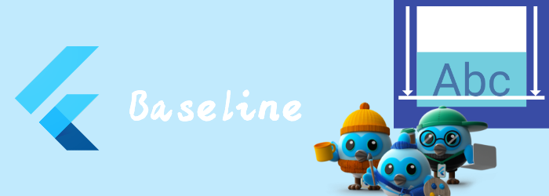

我们来看看布局相关widget: Baseline。

<!--truncate-->

## Baseline

调整child的位置，让child的baseline位于box顶部[baseline](https://api.flutter.dev/flutter/widgets/Baseline/baseline.html) 这么多距离，这个box就是Baseline。

```dart
const Baseline(
{Key? key,
required double baseline,
required TextBaseline baselineType,
Widget? child}
)
```

举个例子

```dart
Container(
  color: Colors.green,
  alignment: Alignment.center,
  height: 100,
  width: 320,
  child: Container(
    child: Baseline(baseline:50, baselineType:TextBaseline.alphabetic, child: Text("helloworld",),),
    color: Colors.red,
  ),
)
```


