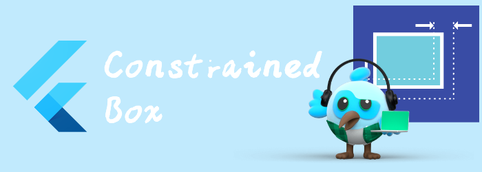

我们来看看布局相关widget: ConstrainedBox。

<!--truncate-->

## ConstrainedBox

对其child施加额外约束的widget。

关于什么是[BoxConstraints](https://api.flutter.dev/flutter/rendering/BoxConstraints-class.html)，可以参见之前学习Container时的部分。

```dart
ConstrainedBox(
  constraints: const BoxConstraints.expand(),
  child: const Card(child: Text('Hello World!')),
)
```

```dart
Container(
  color: Colors.green,
  alignment: Alignment.center,
  height: 100,
  width: 320,
  child: ColoredBox(
    color: Colors.red,
    child: ConstrainedBox(
        constraints: BoxConstraints.tightFor(width: 100, height: 50),
    child: Text("hello world"),),
  ),
)
```


# UnconstrainedBox

不把约束传递给child，child可以以真实大小渲染。

如果超出了box的边界，还是会出现黄框警告。

```dart
Container(
  color: Colors.green,
  alignment: Alignment.center,
  height: 100,
  width: 100,
  child: Text("this is a long text"))
```


```dart
Container(
  color: Colors.green,
  alignment: Alignment.center,
  height: 100,
  width: 100,
  child: UnconstrainedBox(child: Text("this is a long text")))
```


