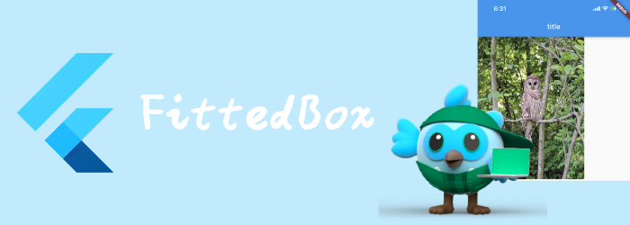

我们来看看布局相关widget: FittedBox。

<!--truncate-->

## FittedBox

根据fit缩放、放置child。fit和Image的fit是类似的。具体相关可以参见Image那一部分。

```dart
const FittedBox(
{Key? key,
BoxFit fit = BoxFit.contain,
AlignmentGeometry alignment = Alignment.center,
Clip clipBehavior = Clip.none,
Widget? child}
)
```

```dart
Container(
  height: 400,
  width: 300,
  color: Colors.red,
  child: FittedBox(
    fit: BoxFit.fill,
    child: Image.network(
        'https://flutter.github.io/assets-for-api-docs/assets/widgets/owl-2.jpg'),
  ),
)
```


