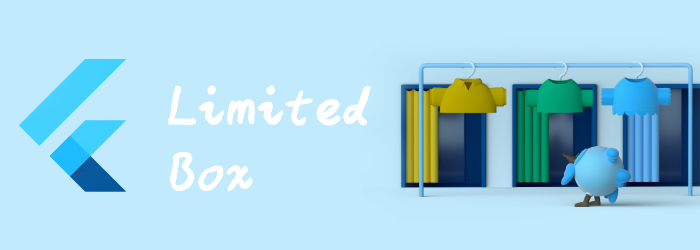

我们来看看布局相关widget: LimitedBox

<!--truncate-->

## LimitedBox

当box是unconstrained时，限制box的大小。

如果这个widget的maximum width是unconstrained时，child将会限制为maxWidth。

同理，如果这个widget的maximum height是unconstrained时，child将会限制为maxHeight。

```dart
const LimitedBox(
{Key? key,
double maxWidth = double.infinity,
double maxHeight = double.infinity,
Widget? child}
)
```

在constrained时，仍然受约束控制

```dart
Container(
  width: 300,
  height: 300,
  color: Colors.red,
  child: LimitedBox(
    child: Container(
      color: Colors.green,
    ),
    maxWidth: 100,
    maxHeight: 100,
  ),
)
```

在unconstrained时，受对应的maxWidth或maxHeight控制。

```dart
ListView(children: [
  LimitedBox(maxHeight: 100,child: Container(color: Colors.red,),)
],)
```


