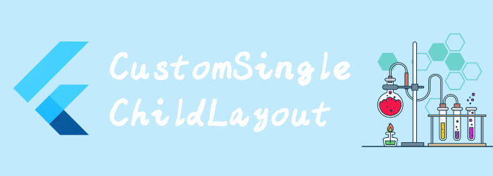

我们来看看布局相关widget: CustomSingleChildLayout

## CustomSingleChildLayout

将layout代理给delegate。

Delegate可以确定child的布局约束，并可以决定将child放置在哪里。delegate也可以确定父级的大小，但父级的大小不能取决于子级的大小。

```dart
const CustomSingleChildLayout(
{Key? key,
required SingleChildLayoutDelegate delegate,//delegate
Widget? child}
)
```

我们看到最重要的是`SingleChildLayoutDelegate`.

## SingleChildLayoutDelegate

当需要layout时，[CustomSingleChildLayout](https://api.flutter.dev/flutter/widgets/CustomSingleChildLayout-class.html)首先调用[getSize](https://api.flutter.dev/flutter/rendering/SingleChildLayoutDelegate/getSize.html)及其传入的约束来确定其大小。然后它调用 [getConstraintsForChild](https://api.flutter.dev/flutter/rendering/SingleChildLayoutDelegate/getConstraintsForChild.html)来确定要应用于child的约束。child完成布局后，调用[getPositionForChild](https://api.flutter.dev/flutter/rendering/SingleChildLayoutDelegate/getPositionForChild.html)来确定child的位置。

当提供新的实例时会调用[shouldRelayout](https://api.flutter.dev/flutter/rendering/SingleChildLayoutDelegate/shouldRelayout.html)方法，以检查新实例是否表示不同的信息。

触发重新布局的最有效方法是向[SingleChildLayoutDelegate](https://api.flutter.dev/flutter/rendering/SingleChildLayoutDelegate-class.html) 的构造函数提供relayout参数。custom layout 会监听这个值，收到通知后就会relayout 。

```dart
/** 比较新旧对象，决定是否relayout,如果该方法返回 false，那么getSize、 getConstraintsForChild和getPositionForChild调用可能会被优化掉。
即使 shouldRelayout返回 false（例如，如果parent更改了其布局），布局方法也可能会被调用。也有可能调用布局方法而不调用shouldRelayout（例如，如果父级更改大小）。*/
bool shouldRelayout(covariant SingleChildLayoutDelegate oldDelegate)
```

```dart
/** 拿到给定约束，确定CustomSingleChildLayout大小，默认是constraints.biggest */
Size getSize(BoxConstraints constraints)s
```

```dart
/** 返回最终应用到child的约束 */
BoxConstraints getConstraintsForChild(BoxConstraints constraints)
```

```dart
/** 应该放置child的位置。
size参数是父级的大小，如果该大小不满足传递给getSizesize的约束，它可能与 getSize 返回的值不同。childSize参数是child的大小，它将满足 getConstraintsForChild返回的约束。
默认将子级定位在父级的左上角。 */
Offset getPositionForChild(Size size,Size childSize)
```

```dart
//这个CustomLayout，会将自身设置为size，并且child居中，宽高为size的一半
class CustomLayoutDelegate extends SingleChildLayoutDelegate {
  CustomLayoutDelegate(this.size) : super(relayout: size);

  final ValueNotifier<Size> size;

  @override
  Size getSize(BoxConstraints constraints) {
    return size.value;
  }

  @override
  BoxConstraints getConstraintsForChild(BoxConstraints constraints) {
    return BoxConstraints.tight(size.value / 2);
  }

  @override
  Offset getPositionForChild(Size size, Size childSize) {
    return Offset(size.width / 4, size.height / 4);
  }

  @override
  bool shouldRelayout(CustomLayoutDelegate oldDelegate) {
    return size != oldDelegate.size;
  }
}

class BasicScreen extends StatefulWidget {
  const BasicScreen({Key? key}) : super(key: key);

  @override
  State<BasicScreen> createState() => _BasicScreenState();
}

class _BasicScreenState extends State<BasicScreen> {
  final ValueNotifier<Size> _size =
      ValueNotifier<Size>(const Size(200.0, 100.0));

  @override
  Widget build(BuildContext context) {
    return Scaffold(
      appBar: AppBar(
        title: Text("title"),
      ),
      body: Column(
        children: [
          ColoredBox(
            color: Colors.red,
            child: CustomSingleChildLayout(
              delegate: CustomLayoutDelegate(_size),
              child: Container(
                color: Colors.teal,
                width: 50,
                height: 300,
              ),
            ),
          ),
          TextButton(
              onPressed: () {
                setState(() {
                  _size.value = Size(200, 100);
                });
              },
              child: Text("click change size"))
        ],
      ),
    );
  }
}
```


