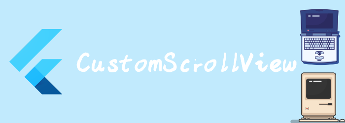

我们来看看布局相关widget: CustomScrollView

## CustomScrollView

使用slivers创建自定义滚动内容的 ScrollView。

[CustomScrollView](https://api.flutter.dev/flutter/widgets/CustomScrollView-class.html)允许您直接提供[slivers](https://api.flutter.dev/flutter/widgets/CustomScrollView/slivers.html)来创建各种滚动内容，例如列表、网格和扩展header。例如，要创建一个滚动视图，其中包含一个appbar，后跟一个列表和一个网格，我们可以使用3种sliver：[SliverAppBar](https://api.flutter.dev/flutter/material/SliverAppBar-class.html)、[SliverList](https://api.flutter.dev/flutter/widgets/SliverList-class.html)和[SliverGrid](https://api.flutter.dev/flutter/widgets/SliverGrid-class.html)。

 [slivers](https://api.flutter.dev/flutter/widgets/CustomScrollView/slivers.html)中的[Widget](https://api.flutter.dev/flutter/widgets/Widget-class.html) 需要生成[RenderSliver](https://api.flutter.dev/flutter/rendering/RenderSliver-class.html) 对象。

如果你要控制初始滚动偏移量，那么提供一个带有 [ScrollController.initialScrollOffset](https://api.flutter.dev/flutter/widgets/ScrollController/initialScrollOffset.html) 的[controller](https://api.flutter.dev/flutter/widgets/ScrollView/controller.html)

```dart
@override
Widget build(BuildContext context) {
  return Scaffold(
    body:CustomScrollView(slivers: [
      SliverAppBar(title: Text("Demo"),),
      SliverGrid(delegate: SliverChildBuilderDelegate((context, index){
        return Container(
          alignment: Alignment.center,
          color: Colors.teal[100 * (index % 9)],
          child: Text('Grid Item $index'),
        );
      },childCount: 20), gridDelegate: SliverGridDelegateWithMaxCrossAxisExtent(
        maxCrossAxisExtent: 200.0,
        mainAxisSpacing: 10.0,
        crossAxisSpacing: 10.0,
        childAspectRatio: 4.0,
      )),
      SliverFixedExtentList(
        itemExtent: 50.0,
        delegate: SliverChildBuilderDelegate(
              (BuildContext context, int index) {
            return Container(
              alignment: Alignment.center,
              color: Colors.lightBlue[100 * (index % 9)],
              child: Text('List Item $index'),
            );
          },
        childCount: 100),
      ),
    ],)
  );
}
```


我们来看看详细的属性。

```dart
const CustomScrollView(
{Key? key,
Axis scrollDirection = Axis.vertical,
bool reverse = false,
ScrollController? controller,
bool? primary,
ScrollPhysics? physics,
ScrollBehavior? scrollBehavior,
bool shrinkWrap = false,//
Key? center,
double anchor = 0.0,
double? cacheExtent,
List<Widget> slivers = const <Widget>[],
int? semanticChildCount,
DragStartBehavior dragStartBehavior = DragStartBehavior.start,
ScrollViewKeyboardDismissBehavior keyboardDismissBehavior = ScrollViewKeyboardDismissBehavior.manual,
String? restorationId,
Clip clipBehavior = Clip.hardEdge}
)  
```

- `scrollDirection`: 滚动方向
- `reverse`:表示是否按照阅读方向相反的方向滑动，如：`scrollDirection`值为`Axis.horizontal` 时，即滑动发现为水平，如果阅读方向是从左到右（取决于语言环境，阿拉伯语就是从右到左）。`reverse`为`true`时，那么滑动方向就是从右往左。
- `controller`：此属性接受一个`ScrollController`对象。`ScrollController`的主要作用是控制滚动位置和监听滚动事件。默认情况下，Widget树中会有一个默认的`PrimaryScrollController`，如果子树中的可滚动组件没有显式的指定`controller`，并且`primary`属性值为`true`时（默认就为`true`），可滚动组件会使用这个默认的`PrimaryScrollController`。这种机制带来的好处是父组件可以控制子树中可滚动组件的滚动行为，例如，`Scaffold`正是使用这种机制在iOS中实现了点击导航栏回到顶部的功能。

- `physics`：此属性接受一个  `ScrollPhysics`类型的对象，它决定可滚动组件如何响应用户操作，比如用户滑动完抬起手指后，继续执行动画；或者滑动到边界时，如何显示。默认情况下，Flutter会根据具体平台分别使用不同的`ScrollPhysics`对象，应用不同的显示效果，如当滑动到边界时，继续拖动的话，在 iOS 上会出现弹性效果，而在 Android 上会出现微光效果。如果你想在所有平台下使用同一种效果，可以显式指定一个固定的`ScrollPhysics`，Flutter SDK中包含了两个`ScrollPhysics`的子类，他们可以直接使用：
  
  - `ClampingScrollPhysics`：列表滑动到边界时将不能继续滑动，通常在Android 中 配合     `GlowingOverscrollIndicator`（实现微光效果的组件） 使用。
  - `BouncingScrollPhysics`：iOS 下弹性效果。
  
- `scrollBehavior`:scroll行为，ios的是[CupertinoScrollBehavior](https://api.flutter.dev/flutter/cupertino/CupertinoScrollBehavior-class.html)，android的是[MaterialScrollBehavior](https://api.flutter.dev/flutter/material/MaterialScrollBehavior-class.html)

- `shrinkWrap`：该属性表示是否根据子组件的总长度来设置`ListView`的长度，默认值为`false` 。默认情况下，`ListView`会在滚动方向尽可能多的占用空间。当`ListView`在一个无边界(滚动方向上)的容器中时，`shrinkWrap`必须为`true`。

- `center`:中心的key, 在center之后的会按滚动方向排列，在center之前的，会按滚动方向相反的方向排列。通俗点就是center为中心点，沿着中心点向两边生长。

  ```dart
  import 'package:flutter/material.dart';
  
  void main() => runApp(const MyApp());
  
  class MyApp extends StatelessWidget {
    const MyApp({Key? key}) : super(key: key);
  
    static const String _title = 'Flutter Code Sample';
  
    @override
    Widget build(BuildContext context) {
      return const MaterialApp(
        title: _title,
        home: MyStatefulWidget(),
      );
    }
  }
  
  class MyStatefulWidget extends StatefulWidget {
    const MyStatefulWidget({Key? key}) : super(key: key);
  
    @override
    State<MyStatefulWidget> createState() => _MyStatefulWidgetState();
  }
  
  class _MyStatefulWidgetState extends State<MyStatefulWidget> {
    List<int> top = <int>[];
    List<int> bottom = <int>[0];
  
    @override
    Widget build(BuildContext context) {
      const Key centerKey = ValueKey<String>('bottom-sliver-list');
      return Scaffold(
        appBar: AppBar(
          title: const Text('Press on the plus to add items above and below'),
          leading: IconButton(
            icon: const Icon(Icons.add),
            onPressed: () {
              setState(() {
                top.add(-top.length - 1);
                bottom.add(bottom.length);
              });
            },
          ),
        ),
        body: CustomScrollView(
          center: centerKey,
          slivers: <Widget>[
            SliverList(
              delegate: SliverChildBuilderDelegate(
                (BuildContext context, int index) {
                  return Container(
                    alignment: Alignment.center,
                    color: Colors.blue[200 + top[index] % 4 * 100],
                    height: 100 + top[index] % 4 * 20.0,
                    child: Text('Item: ${top[index]}'),
                  );
                },
                childCount: top.length,
              ),
            ),
            SliverList(
              key: centerKey,
              delegate: SliverChildBuilderDelegate(
                (BuildContext context, int index) {
                  return Container(
                    alignment: Alignment.center,
                    color: Colors.blue[200 + bottom[index] % 4 * 100],
                    height: 100 + bottom[index] % 4 * 20.0,
                    child: Text('Item: ${bottom[index]}'),
                  );
                },
                childCount: bottom.length,
              ),
            ),
          ],
        ),
      );
    }
  }
  ```

- `anchor`:zero scroll offset的相对位置。默认是0，也就是ScrollView顶部，如果为0.5那么，offset：0就在ScrollView的中心，sliver中的item从中心开始排列

  

- `cacheExtent`: 可见范围(ViewPort)前后都有一个预渲染区域，会提前创建这个区域的widget，cacheExtent定义了这个预渲染区域的长度。

- `slivers`: scrollview要显示的内容

- `dragStartBehavior`: 确定拖动开始的方式。一般来说，将其设置为[DragStartBehavior.start](https://api.flutter.dev/flutter/gestures/DragStartBehavior.html)将使拖动动画更流畅。

- `keyboardDismissBehavior`:键盘消失行为，手动和自动。