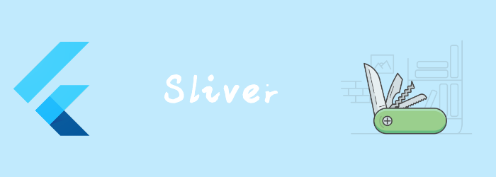

我们上一章讲了CustomScrollView，他的内容是一个Sliver数组，那到底我们能往里放什么呢？我们来看看一些基础的Sliver。

# SliverAppBar

和AppBar类似，不过 他是放在CustomScrollView中的, 有些特有的属性。

```dart
const SliverAppBar(
bool floating = false,
bool pinned = false,
bool snap = false,
double? collapsedHeight,
double? expandedHeight,
bool stretch = false,
double stretchTriggerOffset = 100.0,
AsyncCallback? onStretchTrigger,
  //...其他同AppBar
)
```
- `pinned`: 为true时，当用户滚动，AppBar仍然可以扩展和收缩，但它会保持可见，而不是滚动到视野之外。

  

- `floating`: 朝着appbar滑动时，appbar是否立即可见

  

  

- `snap`:只能和floating一起使用。当floating出现和消失时会有个动画。

  
  
- collapsedHeight: 收起高度，默认是toolbar高度
  
- expandedHeight: 展开高度
  
- stretch: 滚动超过scrollview区域时，是否可以拉伸
  
- stretchTriggerOffset：触发onStretchTrigger的高度
  
- onStretchTrigger: strech到一定高度时触发

# SliverFixedExtentList

固定大小的List。

```dart
const SliverFixedExtentList(
{Key? key,
required SliverChildDelegate delegate,
required double itemExtent}
)
```

```dart
SliverFixedExtentList(
    itemExtent: 50.0,
    delegate: SliverChildBuilderDelegate(
          (BuildContext context, int index) {
        return Container(
          alignment: Alignment.center,
          color: Colors.lightBlue[100 * (index % 9)],
          child: Text('List Item $index'),
        );
      },
    childCount: 100),
  ),
],)
```


# SliverList

每个child自己决定自己的大小。

```dart
const SliverList(
{Key? key,
required SliverChildDelegate delegate}
)
```

```dart
SliverList(delegate: SliverChildListDelegate([
  Container(height: 100,color: Colors.red,),
  Container(height: 100,color: Colors.green,),
  Container(height: 100,color: Colors.blue,),
])
```

```dart
SliverList(delegate: SliverChildBuilderDelegate(
    (BuildContext context, int index) {
  return Container(
    height: 50,
    alignment: Alignment.center,
    color: Colors.lightBlue[100 * (index % 9)],
    child: Text('List Item $index'),
  );
},
childCount: 100))
```

# SliverGrid  

 [gridDelegate](https://api.flutter.dev/flutter/widgets/SliverGrid/gridDelegate.html)决定child的大小和位置。

  ```dart
  const SliverGrid(
  {Key? key,
  required SliverChildDelegate delegate,
  required SliverGridDelegate gridDelegate}
  )
  ```
SliverGridDelegate的实现类有rs

- [SliverGridDelegateWithFixedCrossAxisCount](https://api.flutter.dev/flutter/rendering/SliverGridDelegateWithFixedCrossAxisCount-class.html)
- [SliverGridDelegateWithMaxCrossAxisExtent](https://api.flutter.dev/flutter/rendering/SliverGridDelegateWithMaxCrossAxisExtent-class.html)

### SliverGridDelegateWithFixedCrossAxisCount

固定交叉轴方向数量

```dart
const SliverGridDelegateWithFixedCrossAxisCount(
{required int crossAxisCount,
double mainAxisSpacing = 0.0,//主轴space
double crossAxisSpacing = 0.0,//交叉轴space
double childAspectRatio = 1.0,//宽高比
double? mainAxisExtent}//如果提供了就是item的主轴大小，如果为null，则用childAspectRatio
)
```

```dart
SliverGrid(
delegate: SliverChildBuilderDelegate((context, index) {
  return Container(
    alignment: Alignment.center,
    color: Colors.teal[100 * (index % 9)],
    child: Text('Grid Item $index'),
  );
}, childCount: 20),
gridDelegate: SliverGridDelegateWithFixedCrossAxisCount(
    crossAxisCount: 3,
    childAspectRatio: 4,
    mainAxisSpacing: 10,
    crossAxisSpacing: 10))
```


### SliverGridDelegateWithMaxCrossAxisExtent

固定交叉轴方向最大宽度。

```dart
const SliverGridDelegateWithMaxCrossAxisExtent(
{required double maxCrossAxisExtent,
double mainAxisSpacing = 0.0,
double crossAxisSpacing = 0.0,
double childAspectRatio = 1.0,
double? mainAxisExtent}
)
```

# SliverPadding

为另一个Sliver添加Padding

```dart
const SliverPadding(
{Key? key,
required EdgeInsetsGeometry padding,
Widget? sliver}
)
```

```dart
SliverPadding(padding: EdgeInsets.all(10),sliver: SliverGrid(delegate: SliverChildBuilderDelegate((context, index){
          return Container(
            alignment: Alignment.center,
            color: Colors.teal[100 * (index % 9)],
            child: Text('Grid Item $index'),
          );
        },childCount: 20), gridDelegate: SliverGridDelegateWithMaxCrossAxisExtent(
          maxCrossAxisExtent: 200.0,
          mainAxisSpacing: 10.0,
          crossAxisSpacing: 10.0,
          childAspectRatio: 4.0,
        )),)
```


# SliverPersistentHeader

SliverAppBar使用了SliverPersistentHeader。因此我们就对pinned和floating比较熟悉了。

```dart
const SliverPersistentHeader(
{Key? key,
required SliverPersistentHeaderDelegate delegate,
bool pinned = false,
bool floating = false}
)
```

### SliverPersistentHeaderDelegate

抽象类，需要我们自己实现

```dart
abstract class SliverPersistentHeaderDelegate {
  // header 最大高度；
  double get maxExtent;
  // header 的最小高度；
  double get minExtent;

  // 构建 header。
  // shrinkOffset取值范围[0,maxExtent],当header刚刚到达顶部时，shrinkOffset 值为maxExtent，
  // 如果用户继续向上滑动列表，shrinkOffset的值会随着用户滑动的偏移减小，直到减到0时。
  //
  // overlapsContent：
  Widget build(BuildContext context, double shrinkOffset, bool overlapsContent);
  
  // header 是否需要重新构建；
  bool shouldRebuild(covariant SliverPersistentHeaderDelegate oldDelegate);

  // 下面这几个属性是SliverPersistentHeader在SliverAppBar中时实现floating、snap 
  // 效果时会用到，平时开发过程很少使用到。
  TickerProvider? get vsync => null;
  FloatingHeaderSnapConfiguration? get snapConfiguration => null;
  OverScrollHeaderStretchConfiguration? get stretchConfiguration => null;
  PersistentHeaderShowOnScreenConfiguration? get showOnScreenConfiguration => null;
}
```

```dart
class MyListHeaderDelegate extends SliverPersistentHeaderDelegate {
  int index;
  MyListHeaderDelegate(this.index);
  @override
  Widget build(
      BuildContext context, double shrinkOffset, bool overlapsContent) {
    return SizedBox.expand(child: Container(color: Colors.yellow,child: Text("this is section header $index"),),);
  }

  @override
  double get maxExtent => 100;

  @override
  double get minExtent => 100;

  @override
  bool shouldRebuild(MyListHeaderDelegate oldDelegate) {
    return index != oldDelegate.index;
  }
}
```


# SliverToBoxAdapter

将box widget包裹成sliver

```dart
const SliverToBoxAdapter(
{Key? key,
Widget? child}
)
```

```dart
SliverToBoxAdapter(child: FlutterLogo(size: 60,),)
```

