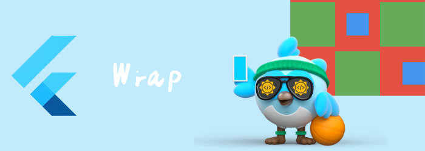

我们来看看布局相关widget: Wrap

# Wrap

[Wrap](https://api.flutter.dev/flutter/widgets/Wrap-class.html)对每个子元素进行布局，并尝试将子元素放置在主轴上与前一个子元素相邻的位置，由[direction](https://api.flutter.dev/flutter/widgets/Wrap/direction.html)给出，在它们之间留出[spacing](https://api.flutter.dev/flutter/widgets/Wrap/spacing.html) 空间。如果没有足够的空间容纳child，[Wrap](https://api.flutter.dev/flutter/widgets/Wrap-class.html)会在交叉轴上创建一个新的行(run)。

将所有children分配到行(run)以后，行(run)中的子项根据主轴上的[alignment](https://api.flutter.dev/flutter/widgets/Wrap/alignment.html)和交叉轴上的[crossAxisAlignment](https://api.flutter.dev/flutter/widgets/Wrap/crossAxisAlignment.html)进行定位。

然后根据 [runSpacing](https://api.flutter.dev/flutter/widgets/Wrap/runSpacing.html)和[runAlignment](https://api.flutter.dev/flutter/widgets/Wrap/runAlignment.html)将行(run)本身在交叉轴上定位。

```dart
Wrap(
{Key? key,
 //主轴方向
Axis direction = Axis.horizontal,
 //一行中的child的主轴对其方式
WrapAlignment alignment = WrapAlignment.start,
   //一行中的child的交叉轴对其方式
WrapCrossAlignment crossAxisAlignment = WrapCrossAlignment.start,
// 一行中item间的space
double spacing = 0.0,
 //行在交叉轴上的对其方式
WrapAlignment runAlignment = WrapAlignment.start,
 //行间的距离
double runSpacing = 0.0,

TextDirection? textDirection,
VerticalDirection verticalDirection = VerticalDirection.down,
Clip clipBehavior = Clip.none,
List<Widget> children = const <Widget>[]}
)
```

```dart
Container(
      width: 300,
      height: 300,
      color: Colors.red,
      child: Wrap(
        children: [
          Container(
            color: Colors.green,
            width: 100,
            height: 100,
          ),
          Container(
            color: Colors.blue,
            width: 50,
            height: 50,
          ),
          Container(
            color: Colors.green,
            width: 100,
            height: 100,
          ),
          Container(
            color: Colors.blue,
            width: 50,
            height: 50,
          ),
          Container(
            color: Colors.green,
            width: 100,
            height: 100,
          ),
          Container(
            color: Colors.blue,
            width: 50,
            height: 50,
          ),
        ],
        spacing: 10,
        runSpacing: 10,
        alignment: WrapAlignment.spaceBetween,
        crossAxisAlignment: WrapCrossAlignment.center,
        runAlignment: WrapAlignment.end,
      ),
    )
```


