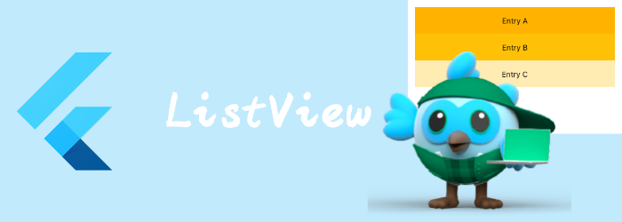

我们来看看布局相关widget: ListView

# ListView

ListView实际上是包含了一个 [SliverList](https://api.flutter.dev/flutter/widgets/SliverList-class.html) 的[CustomScrollView](https://api.flutter.dev/flutter/widgets/CustomScrollView-class.html) 。

所以我们看到他有很多sliver相关的属性：

```dart
ListView(
{
  EdgeInsetsGeometry? padding,
  double? itemExtent,
Widget? prototypeItem,
  List<Widget> children = const <Widget>[],
  //sliver相关属性
  Key? key,
Axis scrollDirection = Axis.vertical,
bool reverse = false,
ScrollController? controller,
bool? primary,
ScrollPhysics? physics,
bool shrinkWrap = false,
bool addAutomaticKeepAlives = true,
bool addRepaintBoundaries = true,
bool addSemanticIndexes = true,
double? cacheExtent,
int? semanticChildCount,
DragStartBehavior dragStartBehavior = DragStartBehavior.start,
ScrollViewKeyboardDismissBehavior keyboardDismissBehavior = ScrollViewKeyboardDismissBehavior.manual,
String? restorationId,
Clip clipBehavior = Clip.hardEdge}
)
```

- `itemExtent`： item的大小
- `prototypeItem`: 原型item，大小都等同于这个item的大小
- `children`: List的内容

如果你还记得SliverList的**SliverChildBuilderDelegate**的话，那么就很好理解ListView的这两个构造函数了

```dart
ListView.builder(
{
double? itemExtent,
Widget? prototypeItem,
  //通过builder构建
required IndexedWidgetBuilder itemBuilder,
ChildIndexGetter? findChildIndexCallback,
int? itemCount,
....}
)
```

```dart
const ListView.custom(
{
double? itemExtent,
Widget? prototypeItem,
  //通过delegate构建
required SliverChildDelegate childrenDelegate,}
)
```

然后ListView还提供一个带分割线的构造方法

```dart
ListView.separated(
{
  //构建item的builder
required IndexedWidgetBuilder itemBuilder,
ChildIndexGetter? findChildIndexCallback,
    //构建separator的Builder
required IndexedWidgetBuilder separatorBuilder,
required int itemCount,}
)
```


```dart
final List<String> entries = <String>['A', 'B', 'C'];
final List<int> colorCodes = <int>[600, 500, 100];

ListView.builder(
  padding: const EdgeInsets.all(8),
  itemCount: entries.length,
  itemBuilder: (BuildContext context, int index) {
    return Container(
      height: 50,
      color: Colors.amber[colorCodes[index]],
      child: Center(child: Text('Entry ${entries[index]}')),
    );
  }
);
```


