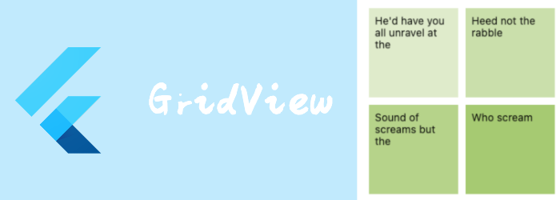

我们来看看布局相关widget: GridView

# GridView

[GridView](https://api.flutter.dev/flutter/widgets/GridView-class.html) 本质上只是一个：包含了一个  [SliverGrid](https://api.flutter.dev/flutter/widgets/SliverGrid-class.html) 的[CustomScrollView](https://api.flutter.dev/flutter/widgets/CustomScrollView-class.html) 。

所以很多属性也是和SliverGrid一致的。

```dart
GridView(
{
  required SliverGridDelegate gridDelegate,
  List<Widget> children = const <Widget>[],
  //sliver相关
  Key? key,
Axis scrollDirection = Axis.vertical,
bool reverse = false,
ScrollController? controller,
bool? primary,
ScrollPhysics? physics,
bool shrinkWrap = false,
EdgeInsetsGeometry? padding,
bool addAutomaticKeepAlives = true,
bool addRepaintBoundaries = true,
bool addSemanticIndexes = true,
double? cacheExtent,
int? semanticChildCount,
DragStartBehavior dragStartBehavior = DragStartBehavior.start,
Clip clipBehavior = Clip.hardEdge,
ScrollViewKeyboardDismissBehavior keyboardDismissBehavior = ScrollViewKeyboardDismissBehavior.manual,
String? restorationId}
)
```

- `gridDelegate`: 之前已经讲过了，控制item的布局，大小
- `children`: 所有item

除了直接提供`children`，GridView当然也可以通过build和delegate来创建，我们来看看这两个构造函数

```dart
GridView.builder(
{
required SliverGridDelegate gridDelegate,
required IndexedWidgetBuilder itemBuilder,
ChildIndexGetter? findChildIndexCallback,
int? itemCount,
...}
)
```

```dart
const GridView.custom(
{required SliverGridDelegate gridDelegate,
required SliverChildDelegate childrenDelegate,
...}
)
```

之前说过SliverGridDelegate有两个实现类：

-  [SliverGridDelegateWithFixedCrossAxisCount](https://api.flutter.dev/flutter/rendering/SliverGridDelegateWithFixedCrossAxisCount-class.html) ：固定交叉轴方向数量

- [SliverGridDelegateWithMaxCrossAxisExtent](https://api.flutter.dev/flutter/rendering/SliverGridDelegateWithMaxCrossAxisExtent-class.html) ：固定交叉轴方向最大宽度

所以我们就很好理解GridView的这两个构造函数了

```dart
GridView.count(
{required int crossAxisCount,
double mainAxisSpacing = 0.0,
double crossAxisSpacing = 0.0,
double childAspectRatio = 1.0,
 ...
})
```

```dart
GridView.extent({
 required double maxCrossAxisExtent,
double mainAxisSpacing = 0.0,
double crossAxisSpacing = 0.0,
double childAspectRatio = 1.0,
...})
```

