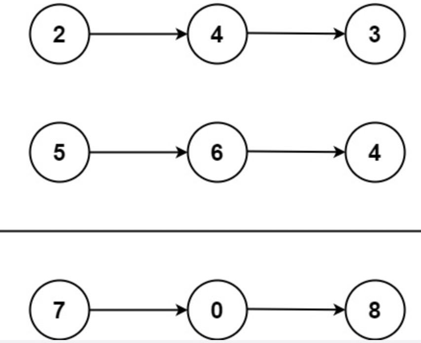

### 题目

来源：力扣（LeetCode）
链接：https://leetcode-cn.com/problems/add-two-numbers

给你两个 非空 的链表，表示两个非负的整数。它们每位数字都是按照 逆序 的方式存储的，并且每个节点只能存储 一位 数字。

请你将两个数相加，并以相同形式返回一个表示和的链表。

你可以假设除了数字 0 之外，这两个数都不会以 0 开头。

 

示例 1：




输入：l1 = [2,4,3], l2 = [5,6,4]
输出：[7,0,8]
解释：342 + 465 = 807.
示例 2：

输入：l1 = [0], l2 = [0]
输出：[0]
示例 3：

输入：l1 = [9,9,9,9,9,9,9], l2 = [9,9,9,9]
输出：[8,9,9,9,0,0,0,1]


提示：

每个链表中的节点数在范围 [1, 100] 内
0 <= Node.val <= 9
题目数据保证列表表示的数字不含前导零

### 答案

```swift title="Solution.swift"
public class ListNode {
     public var val: Int
     public var next: ListNode?
     public init() { self.val = 0; self.next = nil; }
     public init(_ val: Int) { self.val = val; self.next = nil; }
     public init(_ val: Int, _ next: ListNode?) { self.val = val; self.next = next; }
}

class Solution {
    func addTwoNumbers(_ l1: ListNode?, _ l2: ListNode?) -> ListNode? {
        //如果某个数字为0，那么直接返回另一个数字
        if l1?.val == 0 && l1?.next == nil { return l2 }
        if l2?.val == 0 && l2?.next == nil { return l1 }
        
        //初始化
        let head: ListNode = ListNode()
        var tail: ListNode = head
        var carry = 0//进位
        var p1 = l1
        var p2 = l2
        //遍历
        while(p1 != nil || p2 != nil || carry > 0) {
            let value1 = p1?.val ?? 0
            let value2 = p2?.val ?? 0
            let sum = value1 + value2 + carry
            let node = p1 ?? p2 ?? ListNode()//复用已有节点
            node.val = sum % 10//赋值
            tail.next = node //添加节点到尾部
            tail = node //移动尾指针
                        
            carry = sum / 10 //计算进位
            p1 = p1?.next //移动到下一个
            p2 = p2?.next //移动到下一个
        }
        return head.next
    }
}
```


